# GCP: Proyecto de Asesor Financiero

## Objetivo

Generar una propuesta de valor a través de la ingesta de datos históricos y en tiempo real de la valorización bursátil de las 10 empresas más importantes de NASDAQ-100.

Para ello se implementará una infraestructura en la nube utilizando:

1. máquina virtual para la ingesta de datos utilizando la biblioteca Yfinance en Python,
2. almacenamiento en Cloud Storage para alojar los datos en crudo,
3. procesamiento de la información almacenada mediante Cloud Functions para
4. alimentar el data warehouse BigQuery,
5. utilizar SQL para hacer consultas a BigQuery,
6. visualización de data en Looker y conexión con PowerBI,
7. modelos de machine learning a partir de la información recabada, y
8. mantener la base de datos actualizada diariamente.

## Tabla de contenidos

* [Objetivo](#objetivo)
* [Introducción](#introducción)
* [Descripción de las tecnologías utilizadas](#Descripción-de-las-tecnologías-utilizadas)
* [Aclaración sobre posibles gastos](#Aclaración-sobre-posibles-gastos)
* [Requisitos](#Requisitos)
* Paso 1

  * [Creación de cuenta de Gmail y activación de período de prueba](#creación-de-cuenta-de-Gmail-y-activación-de-período-de-prueba)
  * [Compartir el saldo del período de prueba con otras personas](#compartir-el-saldo-del-período-de-prueba-con-otras-personas)
* Paso 2

  * Creación de una instancia de máquina virtual
  * Configurando la nueva instancia
  * * Nombre, región y zona
    * Serie y tipo de máquina
    * Disco duro y sistema operativo
    * Configuraciones avanzadas de dirección IPv4 externa estática
    * Finalizar la configuración y crear la instancia
* Paso 3

  * Apagar una instancia
  * Modificar una instancia
  * Eliminar una instancia
  * Iniciar una instancia
* Paso 4

  * Instalación del entorno de Anaconda en la máquina virtual
  * Acceso remoto a la instancia desde la Terminal y VSC

## Introducción

El presente proyecto tiene como objetivo familiarizar con las herramientas elementales de Google Cloud Platform para el desarrollo de una arquitectura de carga y gestión de datos.

Se parte desde una máquina virtual que nos permita conectarnos de manera remota para aprovechar al máximo el período de prueba y entender cómo funciona la computación en la nube.

Además, debido a que el presente proyecto tiene como fuente de ingesta de datos una biblioteca de Python, se cree conveniente y de bajo costo el uso de una máquina virtual para extraer información y hacer webscraping para analizar las empresas con mayor valuación de mercado.

Al mismo tiempo, al generar un despliegue de principio a fin en la nube, nos facilita mucho la interacción entre los distintos servicios dado que todas las instancias de análisis y transformación de la información ocurren dentro de un mismo entorno.

En este sentido, ofreceremos un producto de Machine Learning aprovechando la máquina virtual y la velocidad de BigQuery para procesar la información de manera que podamos evaluar tendencias del mercado burstil.

De las estrategias empleadas en el presente proyecto, podemos destacar el potencial de información que se puede extraer para analizar y la funcionalidad en la nube para elaborar un producto que provea de información actualizada diariamente.

## Descripción de las tecnologías utilizadas

 - Máquina virtual para ejecutar aplicaciones.

 - Solución de almacenamiento para guardar datos.

 - Almacén de datos completamente gestionado por GCP para posterior análisis.

 - Aprendizaje automático en BigQuery para crear y ejecutar modelos de aprendizaje automático en SQL.

 - Consultas SQL estándar para interactuar con datos en BigQuery.

 - Funciones sin servidor para aplicaciones basadas en eventos.

 - Lenguaje de programación utilizado.

 - Manipulación y análisis de datos.

 - Computación numérica.

 - Crear visualizaciones estáticas, animadas e interactivas.

 - Aprendizaje automático.

 - Framework de aprendizaje profundo.

 - API de redes neuronales de alto nivel.

 - Procesamiento de lenguaje natural.

 - Estimación e interpretación de modelos estadísticos.

 - Biblioteca de imágenes para Python.

## Aclaración sobre posibles gastos

* Cada cuenta de Gmail, cuenta con un período de prueba de 90 días y un saldo de US$300 para usar en GCP.
* Durante este período, no se genera ningún tipo de cargo.
* El uso por los servicios de GCP generan gastos que son absorbidos por el saldo de US$300.
* De esta manera podemos analizar el consumo eventual que genera operar utilizando GCP.
* Un objetivo de este proyecto es la reducción de costos probando diferentes alternativas.
* Para acceder a este beneficio, es necesario disponer de una tarjeta de crédito o débito habilitada.
* No se genera ningún cargo en la tarjeta, pero durante el período de prueba no se puede eliminar la tarjeta de la cuenta, de lo contrario, no se puede seguir usando el período de prueba.
* La cuenta de GCP se paraliza automáticamente pasados los 90 días o si el saldo llega a US$ 0.
* Es decir, no hay problema si olvidamos servicios encendidos. Todos ellos serán inhabilitados llegado ese punto.
* Todavía podemos acceder a la información relacionada con el proyecto y se conserva todo aquello que está incluido en la capa gratuita de GCP.
* Se pueden asignar todos los proyectos a una otra cuenta de facturación (por ejemplo, una cuenta que disponga saldo del período de prueba) para poder proseguir con el uso de los servicios.

## Requisitos

* Disponer de una cuenta de facturación bajo período de prueba o activada.
* Tarjeta bancaria (crédito o débito)
* Un compañero bondadoso con una cuenta de facturación bajo período de prueba o activada que quiera compartir el saldo.

## Paso 1

### Creación de cuenta de Gmail y activación de período de prueba

* Ver la siguiente guía: [Cómo acceder a la prueba gratituita con un crédito de US$300 para usar GCP](https://github.com/datacloudclub/datacloudclub/blob/main/Google%20Cloud%20Platform%20(GCP)/Gu%C3%ADas/como_acceder.md#c%C3%B3mo-acceder-a-la-prueba-gratituita-con-un-cr%C3%A9dito-de-us300-para-usar-gcp)

### Compartir el saldo del período de prueba con otras personas

* Ver la siguiente guía: [Cómo habilitar a otros compañeros a usar mi cuenta de facturación para que podamos trabajar colaborativamente sin que tengan que activar el período de prueba gratuito]()

[volver a la Tabla de contenidos]( #tabla-de-contenidos)

## Paso 2

### Creación de una instancia de máquina virtual

Podemos ingresar desde la Consola de GCP: [http://console.cloud.google.com](http://console.cloud.google.com).

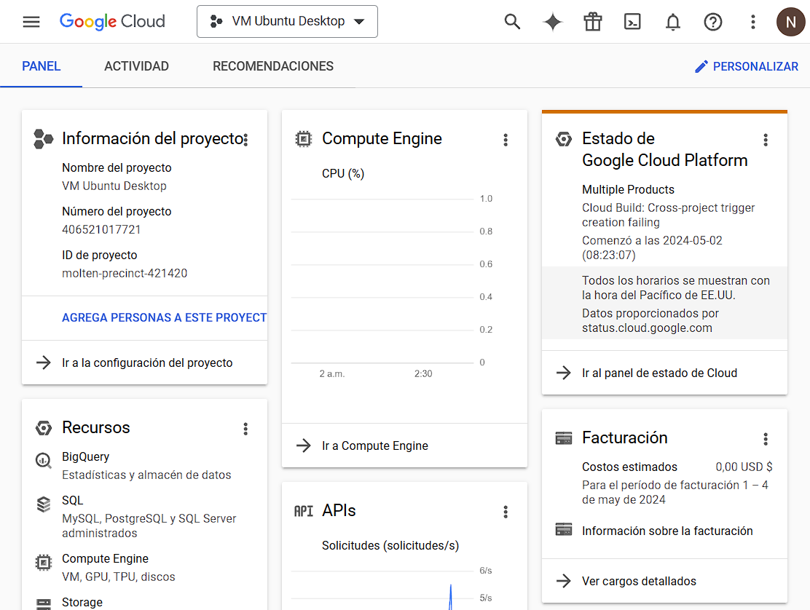

En el botón de tres líneas horizontales de la parte superior izquierda vamos a encontrar el Menú de Navegación por los servicios:

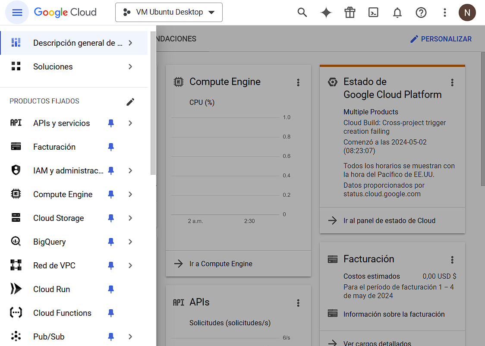

Al final de la lista encontraremos la opción de ver todos los productos por si Compute Engine no aparece en la lista.

Seleccionamos Compute Engine:

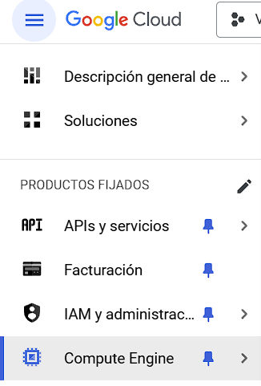

La primera vez que intentemos ingresar en nuestro proyecto, deremos habilitar la API del servicio de Compute Engine para poder hacer uso de todas sus funcionalidades y crear una máquina virtual.

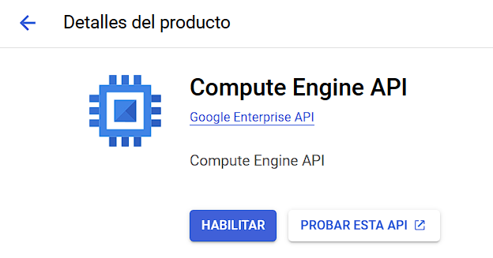

Una vez que se encuentre habilitada la API, vamos a poder utilizar el servicio.

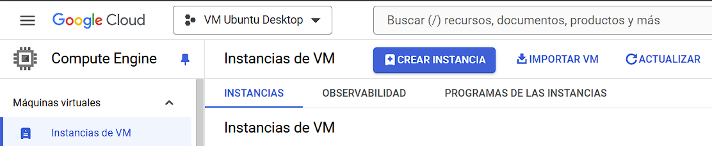

Dentro de Compute Engine, en Instancias de VM que es el servicio que se muestra de forma predeterminada, hacemos click sobre "Crear Instancia" para crear una nueva máquina virtual.

### Configurando la nueva máquina virtual

#### Nombre, región y zona

La máquina virtual puede ser modificada posteriormente en cuanto a la cantidad de procesamiento y memoria que deseemos, la cantidad de memoria en el disco rígido asociado a ella, la configuración de la red e incluso su nombre.

Pero la elección de la región y la zona no puede ser modificada una vez creada la máquina virtual.

Elegimos:

* **Región**: us-central1 (Iowa)
* **Zona**: us-central1-a

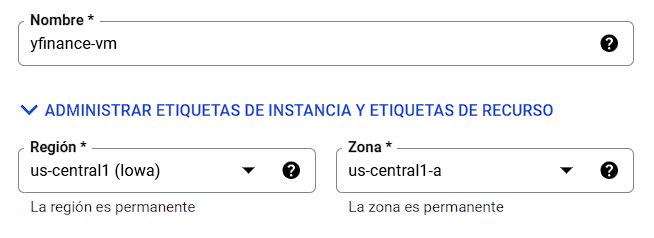

El motivo de esta elección es que todos los servicios de GCP funcionan en una zona. No todos los servicios están disponibles en todas las zonas, como por ejemplo sucede con Sudamérica San Pablo o Santiago.

De manera que si queremos hacer uso de todos los servicios, deberemos elegir una zona donde estén todos disponibles. Además los procesos se llevan a cabo de manera remota. Por lo tanto, la interconexión entre los servicios en la nube se hará íntegramente en Iowa.

#### Serie y tipo de máquina

La diferencia entre series depende de la cantidad de núcleos, la cantidad de memoria RAM y la potencia de las tarjetas gráficas asociadas a la máquina virtual.

En otras palabras, el precio que se paga por la máquina virtual, depende de la potencia que necesitemos.

De todas maneras, se puede modificar esta cantidad en cualquier momento posteriormente a su creación.

Elegimos la máquina E2 de tipo económico, es la Serie incluída en la capa gratuita.

Para aprovechar el crédito de prueba, podemos elegir cualquiera.

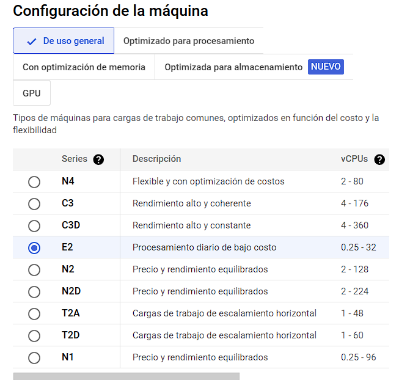

Nótese como al elegir distinto tipo de máquina, cómo varía el precio.

Tener en cuenta que el costo generado por la máquina virtual es mientras se encuentre encendida. Si la máquina virtual está apagada (se puede prender y apagar a voluntad) no genera gastos, pero el disco rígido asociado al ser persistente (que no se borra cuando se apaga la máquina sino que persiste) si genera gastos como figura en la siguiente imagen:

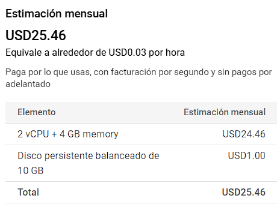

En cuanto al tipo de máquina, el tipo e2-micro está incluido en la capa gratuita. Pero para el presente ejemplo usaremos una e2-medium.

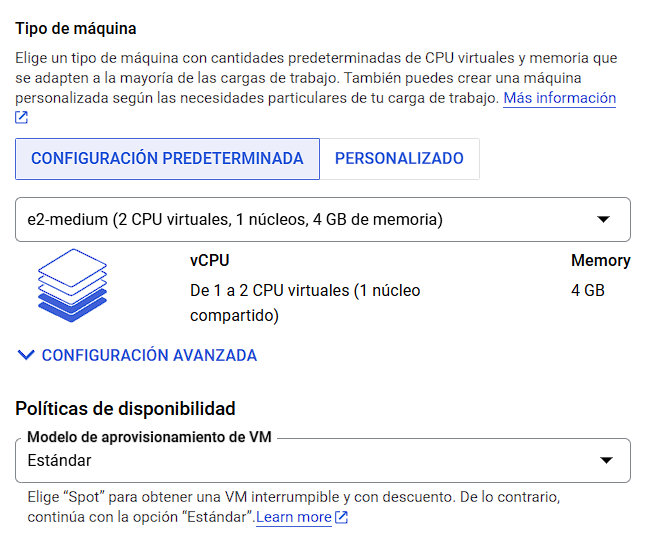

#### Disco duro y sistema operativo

Para cambiar el sistema operativo y el tamaño del disco, hacemos click en el botón "Cambiar"

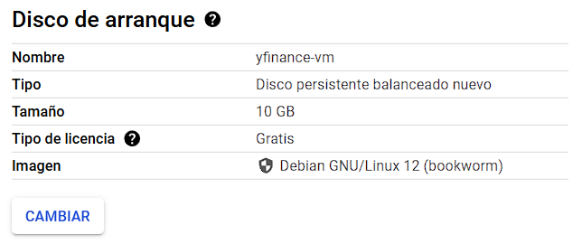

Elegimos la siguiente configuración:

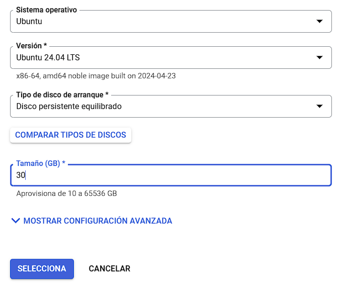

* **Sistema operativo:** Ubuntu
* **Versión:** 24.04 LTS (la versión más reciente, también se puede probar la 20, 22, 23)
* **Tipo de disco de arranque:** disco persistente equilibrado
* **Tamaño (GB):** 30

Hacemos click en seleccionar para cerrar la ventana y confirmamos que los cambios fueron realizados.

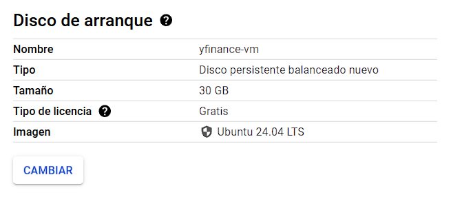

#### Configuraciones avanzadas de dirección IPv4 externa estática

Para el presente ejemplo no vamos a introducir más cambios con lo que podemos hacer click en "Crear".

Pero vale notar una configuración extra que puede ser de utilidad y comodidad. Puede ser modificada en cualquier momento.

Cada máquina virtual funciona con una dirección de IP interno de GCP, y una dirección de IP externa donde podemos conectarnos a ella vía remota.

La asignación de la dirección de IP es automática por ser "Efímera" es decir, que nos reserva una dirección IP global mientras la máquina esté encendida, pero al ser apagada, y luego reiniciada, la dirección de IP externa probablemente sea distinta.

Para reservar una dirección IP única para nosotros, GCP nos ofrece la creación de una IP personal (el costo es muy bajo, de US$ 0,10 por día).

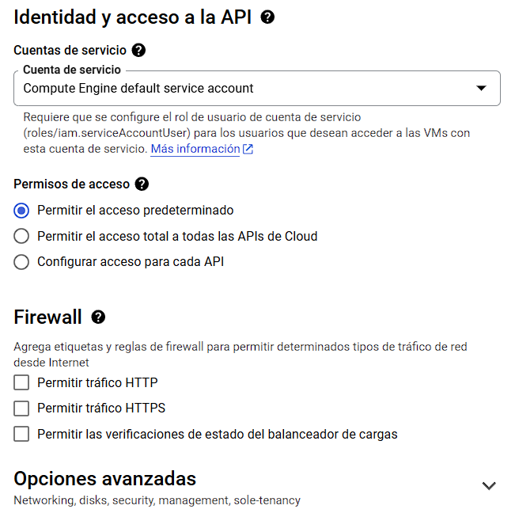

Para asignarnos una dirección IP externa fija, desplegamos Opciones avanzadas, y luego en Herramientas de redes:

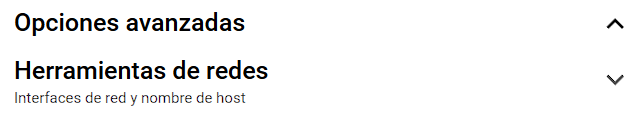

Buscamos donde dice Interfaces de red y desplegamos "default":

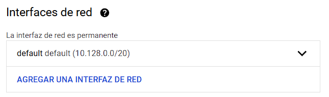

Casi en el fondo encontramos la dirección IPv4 externa, por definición es Efímera.

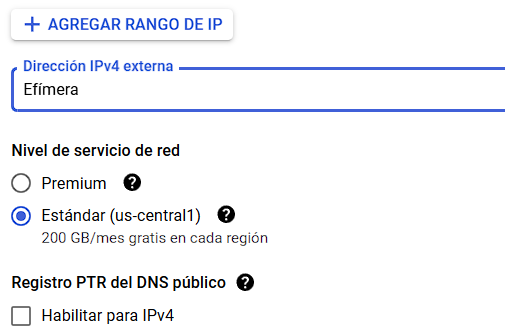

Haciendo click en dirección IPv4 externa podemos encontrar la opción para "Reservar dirección IP externa estática" para que sea fija.

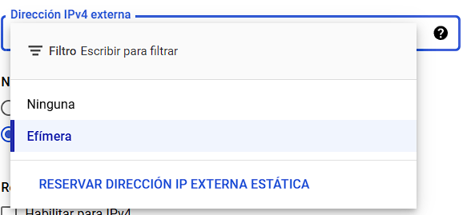

Al hacer click en "Reservar Dirección IP Externa Estática, veremos el siguiente recuadro donde debemos asignar nombre a la dirección de IP reservada:

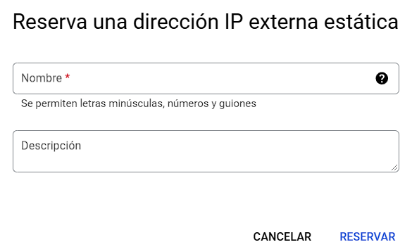

### Finalizar la configuración y crear la instancia

Antes de finalizar, podemos revisar el prespuesto estimado teniendo en cuenta si estuviese la instancia siempre encendida y a plena capacidad de consumo:

Siempre es aconsejable tener en cuenta la página oficial con respecto a los precios: [Página de precios de Compute Engine](https://cloud.google.com/compute/all-pricing)

Para finalizar podemos hacer click en "Crear" para crear la instancia.

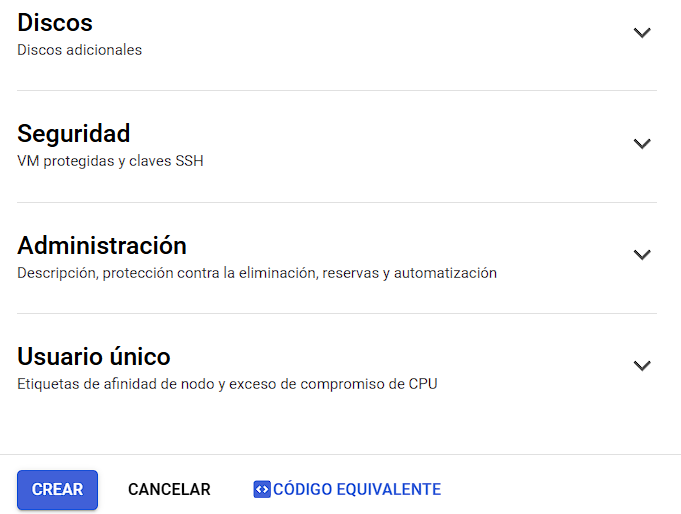

¡Felicitaciones! Hemos creado una instancia de máquina virtual.

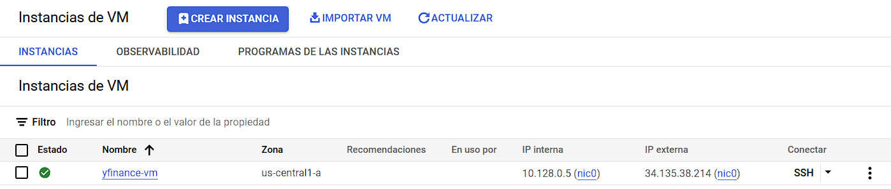

Nótese la siguiente configuración de la instancia (este es mi ejemplo, en su caso serán otros valores).

* **Dirección IP interna**: 10.128.0.5
* **Dirección IP externa**: 34.135.38.214

Haciendo click en el botón **SSH**, se inicia en una ventana nueva la terminar para acceder a la instancia creada.

## Paso 3

### Apagar una instancia

Para apagar una instancia y así prevenir el consumo y gasto por parte de una instancia de máquina virtual, debemos seleccionar la instancia que queremos detener:

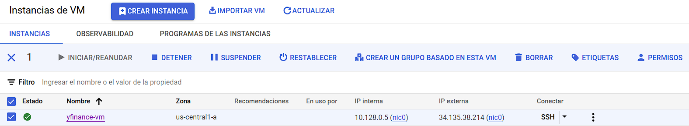

Y apretamos en la opción de "Detener" para detener la instancia.

Recibimos el siguiente recordatorio, mientras la instancia de VM esté apagada, no generará cargos. Pero sí generarán cargos, los discos persistentes (en nuestro caso el disco de 30GB donde está instalado el sistema operativo) y las direcciones IP externas estáticas, si hubiera.

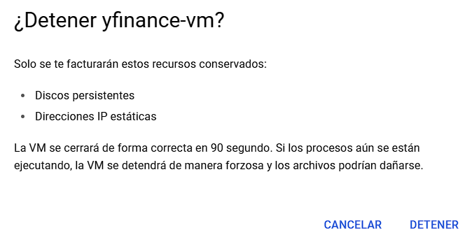

Hacemos click en "Detener" para detener la instancia.

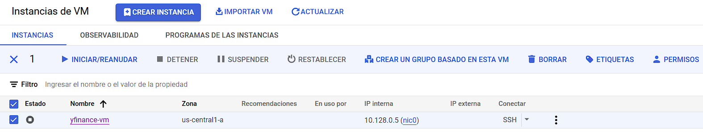

El Estado en forma de cuadrado blanco en un círculo gris (a diferencia del tilde verde) implica que la instancia está detenida.

La dirección IP externa al no ser estática desaparece. Si hubiesemos configurado una dirección de IP externa estática, detenida la instancia, todavía permanecería la IP externa al igual que la interna.

Mientras la instancia esté detenida, no es posible acceder a ella vía SSH.

Algunas modificaciones en su configuración y la eliminación de la instancia, ambas requieren que la instancia esté detenida.

### Modificar una instancia

Para modificar una instancia, basta hacer click sobre su nombre:

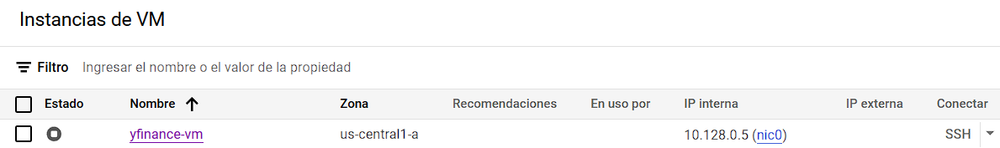

Allí accedemos a las propiedades de la instancia:

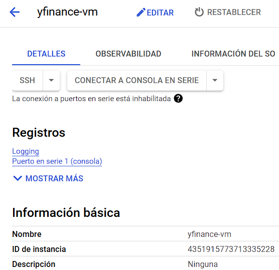

Y haciendo click sobre el lapiz "Editar" vamos a poder editar la configuración de la instancia:

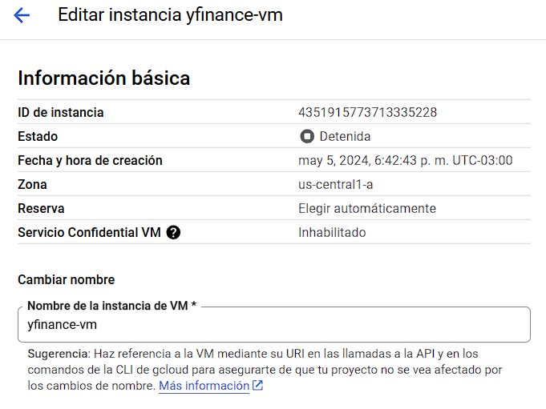

Aquí lo único que no vamos a poder cambiar es la zona y región de la instancia. Luego desde el nombre, serie de computadora, capacidad de disco persistente, sistema opertativo, vamos a poder modificar aquí una vez creada la instancia.

### Eliminar una instancia

Para eliminar una instancia, la misma debe estar detenida. Seleccionamos la instancia que deseamos eliminar:

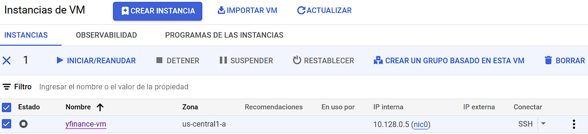

Hacemos click sobre el botón "Borrar" y recibimos la siguiente advertencia:

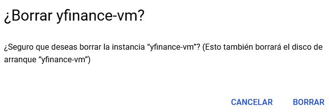

Al hacer click sobre "Borrar" comenzará la eliminación de la instancia y, dependiendo de la configuración inicial, también eliminará el disco asociado a la misma.
