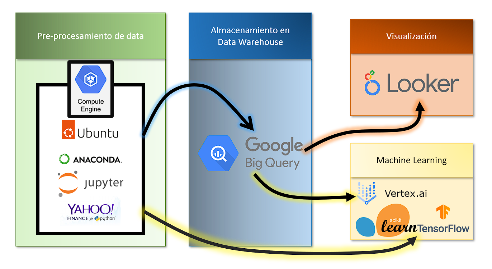
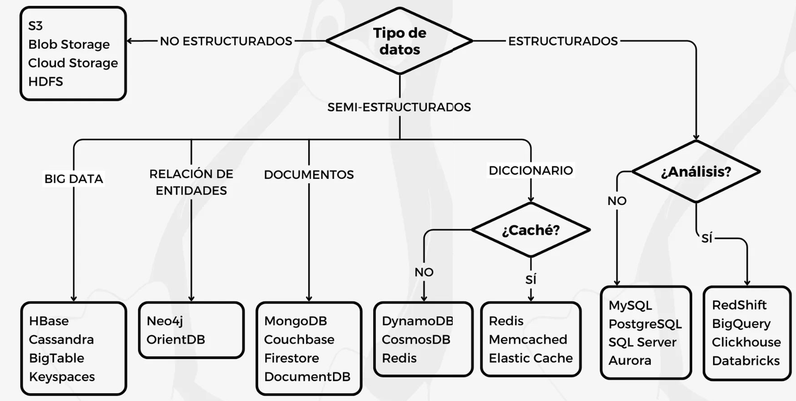

# GCP: Proyecto de Asesor Financiero

## Objetivo

Generar una propuesta de valor a través de la ingesta de datos históricos y en tiempo real de la valorización bursátil de las 10 empresas más importantes de NASDAQ-100.

Para ello se implementará una infraestructura en la nube utilizando:

1. máquina virtual para la ingesta de datos utilizando la biblioteca Yfinance en Python,
2. alimentar el data warehouse BigQuery,
3. utilizar SQL para hacer consultas a BigQuery,
4. visualización de data en Looker y conexión con PowerBI,
5. modelos de machine learning a partir de la información recabada, y
6. mantener la base de datos actualizada diariamente con Cloud Functions.

## Tabla de contenidos

* [Objetivo](https://github.com/datacloudclub/GCP-Asesor_financiero?tab=readme-ov-file#objetivo)
* [Introducción](https://github.com/datacloudclub/GCP-Asesor_financiero?tab=readme-ov-file#introducci%C3%B3n)
* [Descripción de las tecnologías utilizadas](https://github.com/datacloudclub/GCP-Asesor_financiero?tab=readme-ov-file#descripci%C3%B3n-de-las-tecnolog%C3%ADas-utilizadas)
* [Aclaración sobre posibles gastos](https://github.com/datacloudclub/GCP-Asesor_financiero?tab=readme-ov-file#aclaraci%C3%B3n-sobre-posibles-gastos)
* [Requisitos](https://github.com/datacloudclub/GCP-Asesor_financiero?tab=readme-ov-file#requisitos)
* Paso 1

  * [Creación de cuenta de Gmail y activación de período de prueba](https://github.com/datacloudclub/GCP-Asesor_financiero?tab=readme-ov-file#creaci%C3%B3n-de-cuenta-de-gmail-y-activaci%C3%B3n-de-per%C3%ADodo-de-prueba)
  * [Compartir el proyecto con otras personas](https://github.com/datacloudclub/GCP-Asesor_financiero?tab=readme-ov-file#compartir-el-proyecto-con-otras-personas)
* Paso 2

  * [Creación de una instancia de máquina virtual](https://github.com/datacloudclub/GCP-Asesor_financiero?tab=readme-ov-file#creaci%C3%B3n-de-una-instancia-de-m%C3%A1quina-virtual)
* Paso 3

  * Instalación de gcloud CLI
  * Conexión remota mediante SSH
* Paso 4

  * Instalación del entorno de Anaconda en la instancia
* Paso 5

  * Usar un Jupyter Server para comenzar a trabajar con Python
* Paso 6

  * Webscraping para obtener las companías de mayor capitalización
* Paso 7

  * Cómo utilizar la biblioteca Yfinance
* Paso 8

  * Conectando desde Python a BigQuery para tranferir la información recabada a la base de datos
* Paso 9

  * Uso de comandos SQL y de Bq para realizar queries a BigQuery
* Paso 10

  * Conexión de BigQuery con Looker y PowerBI
* Paso 11

  * Utilizar Cloud Functions para actualizar la base de datos diariamente
* Paso 12

  * Desplegar herramientas de Machine Learning en BigQuery con BigqueryML
* Paso 13

  * Desplegar herramientas de Machine Learning en Python usando la información en BigQuery

## Introducción

El presente proyecto tiene como objetivo familiarizar con las herramientas elementales de Google Cloud Platform para el desarrollo de una arquitectura de carga y gestión de datos directamente en la nube.

Se parte desde una máquina virtual aprovechando los contenidos del Módulo 4 de Data Science sobre Big Data para reemplazar el VM VirtualBox que corría en nuestra CPU por una instancia de VM en la nube. Este servicio en GCP se llama Compute Engine y se encarga de administrar recursos para máquinas virtuales. Cada una de ellas se llama instancia.

En todo proceso de ETL y EDA, se comienza por extraer una muestra de los datos para analizar su estructura y poder manipularlos. Esto se lleva a cabo en una máquina virtual que nos permite extraer, analizar y transformar detenidamente la estructura de los datos para volcarlos en una base de datos.

Generar un despliegue de principio a fin en la nube nos facilita la interacción entre la generación de los datos desde la máquina virtual y el alojamiento directo en el data warehouse BigQuery sin la necesidad de mayor infraestructura.

¿Por qué usar BigQuery? Como ilustra la imagen a continuación, trabajaremos con tipos de datos estructurados y necesitamos una base de datos tabular (en forma de columnas) para su posterior análisis.

En este sentido, ofreceremos un producto de Machine Learning con Python en la VM y con herramientas de Machine Learning en la nube a través de BigQuery ML y Vertex AI.

Para mantener el data warehouse actualizado, desplegaremos Cloud Functions que irán ingestando una vez al día el valor de cierre de las acciones.

De las estrategias empleadas en el presente proyecto, esperamos que puedan aprender las siguientes habilidades:

* Integrar todos los conocimientos adquiridos en Henry: módulos 1 a 6.
* Crear una máquina virtual para generar un entorno de trabajo.
* Uso de librerías de Python.
* Habilidad para hacer webscraping.
* Ingesta de data en forma de dataframe en Python directamente al data warehouse.
* Conexión con herramientas de visualización.
* Propuesta de valor con Machine Learning en BigQuery con BigQueryML y en Python con las APIs y Frameworks de ML.

[volver a la Tabla de contenidos](https://github.com/datacloudclub/GCP-Asesor_financiero?tab=readme-ov-file#tabla-de-contenidos)

## Descripción de las tecnologías utilizadas

 - Máquina virtual para ejecutar aplicaciones.

 - Almacén de datos completamente gestionado por GCP para posterior análisis.

 - Aprendizaje automático en BigQuery para crear y ejecutar modelos de aprendizaje automático en SQL.

 - Consultas SQL estándar para interactuar con datos en BigQuery.

 - Funciones sin servidor para aplicaciones basadas en eventos.

 - Lenguaje de programación utilizado.

 - Manipulación y análisis de datos.

 - Crear visualizaciones estáticas, animadas e interactivas.

 - Aprendizaje automático.

 - Framework de aprendizaje profundo.

 - API de redes neuronales de alto nivel.

 - Procesamiento de lenguaje natural.

 - Estimación e interpretación de modelos estadísticos.

 - Biblioteca de imágenes para Python.

[volver a la Tabla de contenidos](https://github.com/datacloudclub/GCP-Asesor_financiero?tab=readme-ov-file#tabla-de-contenidos)

## Aclaración sobre posibles gastos

* Cada cuenta de Gmail, cuenta con un período de prueba de 90 días y un saldo de US$300 para usar en GCP.
* Durante este período, no se genera ningún tipo de cargo.
* El uso por los servicios de GCP generan gastos que son absorbidos por el saldo de US$300.
* De esta manera podemos analizar el consumo eventual que genera operar utilizando GCP.
* Un objetivo de este proyecto es la reducción de costos probando diferentes alternativas.
* Para acceder a este beneficio, es necesario disponer de una tarjeta de crédito o débito habilitada.
* No se genera ningún cargo en la tarjeta, pero durante el período de prueba no se puede eliminar la tarjeta de la cuenta, de lo contrario, no se puede seguir usando el período de prueba.
* La cuenta de GCP se paraliza automáticamente pasados los 90 días o si el saldo llega a US$ 0.
* Es decir, no hay problema si olvidamos servicios encendidos. Todos ellos serán inhabilitados llegado ese punto.
* Todavía podemos acceder a la información relacionada con el proyecto y se conserva todo aquello que está incluido en la capa gratuita de GCP.
* Se pueden asignar todos los proyectos a una otra cuenta de facturación (por ejemplo, una cuenta que disponga saldo del período de prueba) para poder proseguir con el uso de los servicios.

[volver a la Tabla de contenidos](https://github.com/datacloudclub/GCP-Asesor_financiero?tab=readme-ov-file#tabla-de-contenidos)

## Requisitos

* Disponer de una cuenta de facturación bajo período de prueba o activada.
* Tarjeta bancaria (crédito o débito)

[volver a la Tabla de contenidos](https://github.com/datacloudclub/GCP-Asesor_financiero?tab=readme-ov-file#tabla-de-contenidos)

## Paso 1

El primer paso es contar con un proyecto asociado a una cuenta de facturación que nos permita utilizar los recursos de GCP.

### Creación de cuenta de Gmail y activación de período de prueba

* Ver la siguiente guía: [Cómo acceder a la prueba gratituita con un crédito de US$300 para usar GCP](https://github.com/datacloudclub/datacloudclub/blob/main/Google%20Cloud%20Platform%20(GCP)/Gu%C3%ADas/como_acceder.md#c%C3%B3mo-acceder-a-la-prueba-gratituita-con-un-cr%C3%A9dito-de-us300-para-usar-gcp)

### Compartir el proyecto con otras personas

* Ver la siguiente guía: [Cómo compartir mi proyecto con otras personas](https://github.com/datacloudclub/datacloudclub/blob/main/Google%20Cloud%20Platform%20(GCP)/Gu%C3%ADas/uso_compartido_proyecto.md)

[volver a la Tabla de contenidos](https://github.com/datacloudclub/GCP-Asesor_financiero?tab=readme-ov-file#tabla-de-contenidos)

## Paso 2

El segundo paso es la creación de una instancia de máquina virtual para poder interactuar con ella y trabajar de manera remota.

### Creación de una instancia de máquina virtual

* Para crear una instancia de VM: [Cómo crear una máquina virtual](https://github.com/datacloudclub/datacloudclub/blob/main/Google%20Cloud%20Platform%20(GCP)/Gu%C3%ADas/como_crear_vm.md)
* Para administrar una instancia ya creada de VM, cómo se detiene, edita, elimina o inicia: [Administrar una instancia de máquina virtual](https://github.com/datacloudclub/datacloudclub/blob/main/Google%20Cloud%20Platform%20(GCP)/Gu%C3%ADas/modificar_instancia.md)

Dentro de Compute Engine, en Instancias de VM, hacemos click sobre "Crear Instancia" para crear una nueva máquina virtual con las siguientes características:

* **Nombre:** yfinance-vm (sugerencia)
* **Región**: us-central1 (Iowa)
* **Zona**: us-central1-a
* **Tipo de máquina:** E2-medium
* **Sistema operativo:** Ubuntu
* **Versión:** 24.04 LTS (la versión más reciente, también se puede probar la 20, 22, 23)
* **Tipo de disco de arranque:** disco persistente equilibrado
* **Tamaño (GB):** 30

Deberemos recordar la IP externa que nos permitirá conectarnos a la instancia mediante SSH, en este caso, 34.135.38.214.

[volver a la Tabla de contenidos](https://github.com/datacloudclub/GCP-Asesor_financiero?tab=readme-ov-file#tabla-de-contenidos)

## Paso 3

El tercer paso es configurar la conexión remota mediante SSH a la instancia de VM para poder trabajar en ella.

Para ello es necesario instalar:

* Gcloud CLI, la interfaz línea de comandos (CLI en inglés) de Gcloud para conectarnos a la cuenta de GCP desde la Terminal.

Documentación oficial para instalar Gcloud CLI: [Instala Google Cloud CLI](https://cloud.google.com/sdk/docs/install-sdk?hl=es-419)

Si necesitás una guía paso a paso de cómo hacer esto: [Descarga e instalación de Gcloud CLI para conectarme de manera remota a los servicios en la nube](https://github.com/datacloudclub/datacloudclub/blob/main/Google%20Cloud%20Platform%20(GCP)/Gu%C3%ADas/gcloud_cli_install.md).

Y las siguientes extensiones para Visual Studio Code:

* [Remote - SSH para VSC](https://marketplace.visualstudio.com/items?itemName=ms-vscode-remote.remote-ssh)
* [Remote - SSH: editor de archivos de configuración para VSC](https://marketplace.visualstudio.com/items?itemName=ms-vscode-remote.remote-ssh-edit)
* [Remote Explorer para VSC](https://marketplace.visualstudio.com/items?itemName=ms-vscode.remote-explorer)

Necesitamos generar las credenciales que nos permitan identificar nuestra computadora local y configurar la instancia remota para que se puedan conectar mediante canal SSH (Secure Shell), un protocolo de red que permite el acceso remoto a través de una conexión cifrada.

* Completar los pasos para generar credenciales y configuración necesaria: [Cómo conectarse a la instancia vía SSH]()

[volver a la Tabla de contenidos](https://github.com/datacloudclub/GCP-Asesor_financiero?tab=readme-ov-file#tabla-de-contenidos)

## Paso 4
