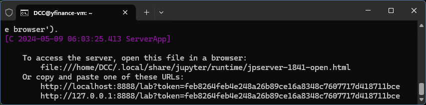
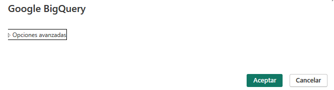

# GCP: Proyecto de Asesor Financiero


## Objetivo

Generar una propuesta de valor a través de la ingesta de datos históricos y en tiempo real de la valorización bursátil de las empresas del índice NASDAQ-100.

Para ello se implementará una infraestructura en la nube utilizando:

1. máquina virtual para la ingesta de datos utilizando la biblioteca Yfinance en Python,
2. alimentar el data warehouse BigQuery,
3. utilizar SQL para hacer consultas a BigQuery,
4. visualización de data en Looker y conexión con PowerBI,
5. modelos de machine learning a partir de la información recabada, y
6. mantener la base de datos actualizada diariamente con Cloud Functions.

## Tabla de contenidos

* [Objetivo](https://github.com/datacloudclub/GCP-Asesor_financiero?tab=readme-ov-file#objetivo)
* [Introducción](https://github.com/datacloudclub/GCP-Asesor_financiero?tab=readme-ov-file#introducci%C3%B3n)
* [Descripción de las tecnologías utilizadas](https://github.com/datacloudclub/GCP-Asesor_financiero?tab=readme-ov-file#descripci%C3%B3n-de-las-tecnolog%C3%ADas-utilizadas)
* [Requisitos](https://github.com/datacloudclub/GCP-Asesor_financiero?tab=readme-ov-file#requisitos)

  * [Creación de cuenta de Gmail y activación de período de prueba](https://github.com/datacloudclub/GCP-Asesor_financiero?tab=readme-ov-file#creaci%C3%B3n-de-cuenta-de-gmail-y-activaci%C3%B3n-de-per%C3%ADodo-de-prueba)
  * [Compartir el proyecto con otras personas](https://github.com/datacloudclub/GCP-Asesor_financiero?tab=readme-ov-file#compartir-el-proyecto-con-otras-personas)
* [Aclaración sobre posibles gastos](https://github.com/datacloudclub/GCP-Asesor_financiero?tab=readme-ov-file#aclaraci%C3%B3n-sobre-posibles-gastos)
* [Paso 1: Preparación de la VM](https://github.com/datacloudclub/GCP-Asesor_financiero?tab=readme-ov-file#paso-1-preparaci%C3%B3n-de-la-vm)

  * [Instalación de Gcloud CLI](https://github.com/datacloudclub/GCP-Asesor_financiero/tree/main#instalaci%C3%B3n-gcloud-cli)
  * [Creación de una instancia de máquina virtual](https://github.com/datacloudclub/GCP-Asesor_financiero?tab=readme-ov-file#creaci%C3%B3n-de-una-instancia-de-m%C3%A1quina-virtual)
  * [Conexión remota mediante SSH](https://github.com/datacloudclub/GCP-Asesor_financiero/tree/main#conexi%C3%B3n-mediante-ssh)
  * [Instalación del entorno de Anaconda en la instancia](https://github.com/datacloudclub/GCP-Asesor_financiero/tree/main#instalaci%C3%B3n-del-entorno-de-anaconda-en-la-instancia)
  * [Usar un Jupyter Server para comenzar a trabajar con Python](https://github.com/datacloudclub/GCP-Asesor_financiero/tree/main#usar-un-jupyter-server-para-comenzar-a-trabajar-con-python)
* [Paso 2: Webscraping y uso de yfinance para obtener capitalización bursátil](https://github.com/datacloudclub/GCP-Asesor_financiero?tab=readme-ov-file#paso-2-webscraping-y-uso-de-yfinance-para-obtener-capitalizaci%C3%B3n-burs%C3%A1til)

  * [Webscraping para obtener las companías que componen el índice Nasdaq-100](https://github.com/datacloudclub/GCP-Asesor_financiero#webscraping-para-obtener-las-compan%C3%ADas-que-componen-el-%C3%ADndice-nasdaq-100)
  * [Uso de la biblioteca Yfinance](https://github.com/datacloudclub/GCP-Asesor_financiero#uso-de-la-biblioteca-yfinance)
* [Paso 3: Conectando a BigQuery](https://github.com/datacloudclub/GCP-Asesor_financiero#creando-cuenta-de-servicios-para-ingresar-a-bigquery-desde-la-instancia)

  * [Crear una Cuenta de Servicio que permita editar y hacer queries a BigQuery (via `gcloud`)](https://github.com/datacloudclub/GCP-Asesor_financiero#crear-una-cuenta-de-servicio-que-permita-editar-y-hacer-queries-a-bigquery-via-gcloud)
  * [Crear una Cuenta de Servicio que permita editar y hacer queries a BigQuery (via Consola)](https://github.com/datacloudclub/GCP-Asesor_financiero#crear-una-cuenta-de-servicio-que-permita-editar-y-hacer-queries-a-bigquery-via-consola)
  * [Cargar data a BigQuery desde la VM](https://github.com/datacloudclub/GCP-Asesor_financiero#cargar-data-a-bigquery-desde-la-vm)
  * Conexión de BigQuery con Looker
  * Conexión de BigQuery con PowerBI
* Paso 4: CI/CD con Cloud Functions

  * Utilizar Cloud Functions para actualizar la base de datos diariamente
* Paso 5: Herramientas de ML en la nube y en Python

  * Desplegar herramientas de Machine Learning en BigQuery con BigQueryML y VertexAI
  * Desplegar herramientas de Machine Learning en Python usando la información en BigQuery

## Introducción

El presente proyecto tiene como objetivo familiarizar con las herramientas elementales de Google Cloud Platform para el desarrollo de una arquitectura de carga y gestión de datos directamente en la nube.

Se parte desde una máquina virtual aprovechando los contenidos del Módulo 4 de Data Science sobre Big Data para reemplazar el VM VirtualBox que corría en nuestra CPU por una instancia de VM en la nube. Este servicio en GCP se llama Compute Engine y se encarga de administrar recursos para máquinas virtuales. Cada una de ellas se llama instancia.

Antes de comenzar, necesitamos contar con un proyecto asociado a una cuenta de facturación que nos permita utilizar los recursos de GCP.

Para conocer más acerca de los descuentos y servicios gratuitos que existen en GCP, y el período de prueba: [Documentación oficial acerca del Programa Gratuito de GCP](https://cloud.google.com/free/docs/free-cloud-features?hl=es-419).


Fuera del período de prueba, existe una capa gratuita de servicios que se pueden utilizar sin generar gastos (aunque de todas maneras se generan ciertos gastos por el uso de la red).

Crearemos la instancia de VM con las características de la capa gratuita: [Documentación sobre nivel gratuito de VM](https://cloud.google.com/free/docs/free-cloud-features?hl=es-419#compute)


### ¿Por qué usar una VM?

En todo proceso de ETL y EDA, se comienza por extraer una muestra de los datos para analizar su estructura y poder manipularlos. Esto se lleva a cabo en una máquina virtual que nos permite extraer, analizar y transformar detenidamente la estructura de los datos para volcarlos en una base de datos.

Generar un despliegue de principio a fin en la nube nos facilita la interacción entre la generación de los datos desde la máquina virtual y el alojamiento directo en el data warehouse BigQuery sin la necesidad de mayor infraestructura.

Para este proyecto, comenzaremos con el despliegue de una instancia de VM del tipo más económico para comprobar su eficacia; ya que, finalizado el período de prueba de 90 días, toda cuenta activa posee un nivel gratuito que incluye una VM micro y una dirección IP estática fija sin costo.

Al mismo tiempo, la VM sólo será utilizada para construir la primera parte del historial de valoración bursátil de las empresas. Una vez comprendida la lógica de funcionamiento del código y de la biblioteca yfinance, podremos reemplazar la VM por Cloud Functions que cumplan el rol de mantener la base de datos actualizada al tener que iterar para adquirir el valor de cierre del día que acaba de terminar.

Por otra parte, cuando querramos hacer modelos de Machine Learning necesitaremos tener comprensión de cómo funcionan las máquinas virtuales.

### ¿Por qué usar BigQuery?

Como ilustra la imagen a continuación, trabajaremos con tipos de datos estructurados y necesitamos una base de datos tabular (en forma de tablas) para su posterior análisis.


En este sentido, ofreceremos un producto de Machine Learning con Python en la VM y con herramientas de Machine Learning en la nube a través de BigQuery ML y Vertex AI.

Para mantener el data warehouse actualizado, desplegaremos Cloud Functions que irán ingestando una vez al día el valor de cierre de las acciones.

De las estrategias empleadas en el presente proyecto, esperamos que puedan aprender las siguientes habilidades:

* Integrar todos los conocimientos adquiridos en Henry: módulos 1 a 6.
* Crear una máquina virtual para generar un entorno de trabajo.
* Uso de librerías de Python.
* Habilidad para hacer webscraping.
* Ingesta de data en forma de dataframe en Python directamente al data warehouse.
* Conexión con herramientas de visualización.
* Propuesta de valor con Machine Learning en BigQuery con BigQueryML y en Python con las APIs y Frameworks de ML.

[volver a la Tabla de contenidos](https://github.com/datacloudclub/GCP-Asesor_financiero?tab=readme-ov-file#tabla-de-contenidos)

## Descripción de las tecnologías utilizadas

[](https://cloud.google.com/compute/) - Máquina virtual para ejecutar aplicaciones.

[](https://cloud.google.com/bigquery/) - Almacén de datos completamente gestionado por GCP para posterior análisis.

[](https://cloud.google.com/bigquery-ml/) - Aprendizaje automático en BigQuery para crear y ejecutar modelos de aprendizaje automático en SQL.

[](https://cloud.google.com/bigquery/sql-reference/) - Consultas SQL estándar para interactuar con datos en BigQuery.

[](https://cloud.google.com/functions/) - Funciones sin servidor para aplicaciones basadas en eventos.

[](https://www.python.org/) - Lenguaje de programación utilizado.

[](https://pandas.pydata.org/) - Manipulación y análisis de datos.

[](https://matplotlib.org/) - Crear visualizaciones estáticas, animadas e interactivas.

[](https://scikit-learn.org/) - Aprendizaje automático.

[](https://www.tensorflow.org/) - Framework de aprendizaje profundo.

[](https://keras.io/) - API de redes neuronales de alto nivel.

[](https://www.nltk.org/) - Procesamiento de lenguaje natural.

[](https://www.statsmodels.org/) - Estimación e interpretación de modelos estadísticos.

[](https://python-pillow.org/) - Biblioteca de imágenes para Python.

[volver a la Tabla de contenidos](https://github.com/datacloudclub/GCP-Asesor_financiero?tab=readme-ov-file#tabla-de-contenidos)

## Requisitos

* Disponer de una cuenta de facturación bajo período de prueba o activada.
  * O bien: Tarjeta bancaria (crédito o débito) para poder iniciar el período de prueba.
  * Si no se posee acceso a una tarjeta: Algún compañero que quiera compartir su proyecto con nosotros.

### Creación de cuenta de Gmail y activación de período de prueba

* Ver la siguiente guía: [Cómo acceder a la prueba gratituita con un crédito de US$300 para usar GCP
  ](https://github.com/datacloudclub/datacloudclub/blob/main/Google%20Cloud%20Platform%20(GCP)/Gu%C3%ADas/como_acceder.md#c%C3%B3mo-acceder-a-la-prueba-gratituita-con-un-cr%C3%A9dito-de-us300-para-usar-gcp)

[volver a la Tabla de contenidos](https://github.com/datacloudclub/GCP-Asesor_financiero?tab=readme-ov-file#tabla-de-contenidos)

### Compartir el proyecto con otras personas

* Ver la siguiente guía: [Cómo compartir mi proyecto con otras personas](https://github.com/datacloudclub/datacloudclub/blob/main/Google%20Cloud%20Platform%20(GCP)/Gu%C3%ADas/uso_compartido_proyecto.md)

[volver a la Tabla de contenidos](https://github.com/datacloudclub/GCP-Asesor_financiero?tab=readme-ov-file#tabla-de-contenidos)

## Aclaración sobre posibles gastos

* Cada cuenta de Gmail, cuenta con un período de prueba de 90 días y un saldo de US$300 para usar en GCP.
* Durante este período, no se genera ningún tipo de cargo.
* El uso por los servicios de GCP generan gastos que son absorbidos por el saldo de US$300.
* De esta manera podemos analizar el consumo eventual que genera operar utilizando GCP.
* Para acceder a este beneficio, es necesario disponer de una tarjeta de crédito o débito habilitada.
* No se genera ningún cargo en la tarjeta, pero durante el período de prueba no se puede eliminar la tarjeta de la cuenta, de lo contrario, no se puede seguir usando el período de prueba.
* La cuenta de GCP se paraliza automáticamente pasados los 90 días o si el saldo llega a US$ 0.
* Es decir, no hay problema si olvidamos servicios encendidos. Todos ellos serán inhabilitados llegado ese punto.
* Luego de terminada la prueba gratuita podemos acceder a la información relacionada con el proyecto y se conserva todo aquello que está incluido en la capa gratuita de GCP.
* Se pueden asignar todos los proyectos a una otra cuenta de facturación (por ejemplo, una cuenta que disponga saldo del período de prueba) para poder proseguir con el uso de los servicios.

[volver a la Tabla de contenidos](https://github.com/datacloudclub/GCP-Asesor_financiero?tab=readme-ov-file#tabla-de-contenidos)

## Paso 1: Preparación de la VM

El primer paso implica la creación de una instancia de VM, cómo conectarse de manera remota a ella y la instalación del entorno Anaconda para comenzar a trabajar en un Jupyter Lab con Python directamente desde el entorno cloud.

### Instalación Gcloud CLI en local

Es necesario instalar en nuestra PC para poder conectarnos con los servicios en GCP:

* Gcloud CLI, la interfaz línea de comandos (CLI en inglés) de Gcloud para acceder a la cuenta de GCP desde la Terminal.
* Documentación oficial para instalar Gcloud CLI: [Instala Google Cloud CLI](https://cloud.google.com/sdk/docs/install-sdk?hl=es-419)
* Si necesitás una guía paso a paso de cómo hacer esto: [Descarga e instalación de Gcloud CLI para conectarme de manera remota a los servicios en la nube](https://github.com/datacloudclub/datacloudclub/blob/main/Google%20Cloud%20Platform%20(GCP)/Gu%C3%ADas/gcloud_cli_install.md).

[volver a la Tabla de contenidos](https://github.com/datacloudclub/GCP-Asesor_financiero?tab=readme-ov-file#tabla-de-contenidos)

### Creación de una instancia de máquina virtual

* Para crear una instancia de VM: [Cómo crear una máquina virtual](https://github.com/datacloudclub/datacloudclub/blob/main/Google%20Cloud%20Platform%20(GCP)/Gu%C3%ADas/como_crear_vm.md)
* Para administrar una instancia ya creada de VM, cómo se detiene, edita, elimina o inicia: [Administrar una instancia de máquina virtual](https://github.com/datacloudclub/datacloudclub/blob/main/Google%20Cloud%20Platform%20(GCP)/Gu%C3%ADas/modificar_instancia.md)

Dentro de Compute Engine, en Instancias de VM, hacemos click sobre "Crear Instancia" para crear una nueva máquina virtual con las siguientes características:

* **Nombre:** yfinance-vm (sugerencia)
* **Región**: us-central1 (Iowa)
* **Zona**: us-central1-a
* **Tipo de máquina:** E2-micro
* **Sistema operativo:** Ubuntu
* **Versión:** 24.04 LTS (la versión más reciente, también se puede probar la 20, 22, 23)
* **Tipo de disco de arranque:** disco persistente equilibrado
* **Tamaño (GB):** 30
* **IP externa fija:** yfinance-vm-ip (sugerencia)

En una ventana de la Terminal, ejecutamos el siguiente comando de `gcloud`, para reservar una dirección ip estática:

```
gcloud compute addresses create yfinance-ip --region us-central1
```

Y luego para anotar la dirección IP externa reservada `ADDRESS/RANGE`:

```
gcloud compute addresses list
```


Creamos la instancia con los parámetros mencionados:

```
gcloud compute instances create yfinance-vm --zone=us-central1-a --machine-type=e2-micro --image=ubuntu-2004-focal-v20230509 --image-project=ubuntu-os-cloud --boot-disk-type=pd-balanced --boot-disk-size=30GB --address=ADDRESS/RANGE
```


[volver a la Tabla de contenidos](https://github.com/datacloudclub/GCP-Asesor_financiero?tab=readme-ov-file#tabla-de-contenidos)

### Conexión mediante SSH

Necesitamos generar las credenciales que nos permitan conectarnos a la instancia mediante canal SSH (Secure Shell), un protocolo de red que permite el acceso remoto a través de una conexión cifrada.

* Para configurar la conexión remota a la instancia vía SSH: [Cómo conectarse a la instancia vía SSH](https://github.com/datacloudclub/datacloudclub/blob/main/Google%20Cloud%20Platform%20(GCP)/Gu%C3%ADas/conexion_ssh.md)
* Para acceder via SSH con Visual Studio Code:
  * [Remote - SSH para VSC](https://marketplace.visualstudio.com/items?itemName=ms-vscode-remote.remote-ssh)
  * [Remote - SSH: editor de archivos de configuración para VSC](https://marketplace.visualstudio.com/items?itemName=ms-vscode-remote.remote-ssh-edit)
  * [Remote Explorer para VSC](https://marketplace.visualstudio.com/items?itemName=ms-vscode.remote-explorer)

[volver a la Tabla de contenidos](https://github.com/datacloudclub/GCP-Asesor_financiero?tab=readme-ov-file#tabla-de-contenidos)

### Instalación del entorno de Anaconda en la instancia

Para descargar Anaconda, [visitamos la página oficial](https://www.anaconda.com/) en nuestro explorador en local. Vamos a donde dice "Free Download"


En el recuadro donde nos pide correo electrónico, debajo dice "skip registration" para evitar registrarnos.


Allí veremos las descargas para las distintas plataformas. En Linux, buscamos el link correspondiente a la descarga de 64-bit (x86), apretamos click derecho sobre él y elegimos "Copiar dirección del vínculo".


Ingresamos desde una Terminal de Windows usando el nombre de `host` que habíamos declarado en el archivo `config`:

```
ssh yfinance
```

Dentro de la instancia: `wget` para descargar el archivo, y pegamos la URL que habíamos copiado en la página de descargas:

```
wget https://repo.anaconda.com/archive/Anaconda3-2024.02-1-Linux-x86_64.sh
```


Luego de que se haya descargado, convertimos el archivo descargado en ejecutable utlizando el comando `chmod +x Anaconda3-2024.02-1-Linux-x86_64.sh` y lo ejecutamos `./Anaconda3-2024.02-1-Linux-x86_64.sh`

```
chmod +x Anaconda3-2024.02-1-Linux-x86_64.sh
./Anaconda3-2024.02-1-Linux-x86_64.sh
```


Presionamos `ENTER `y deberemos leer el Acuerdo de Licencia hasta llegar al final para escribir "yes" aceptándo los términos y condiciones para comenzar la descarga:


Luego nos ofrece un directorio de instalación, presionamos `ENTER `para dejar el directorio por defecto `/home/{usuario}/anaconda3`


Antes de finalizar, nos pregunta si cada vez que iniciamos la VM queremos hacerlo en un entorno de Anaconda, ponemos "yes":


Una vez finalizada la instalación, nos pide salir de la conexión con la VM, escribimos el comando `exit`


Y luego nos conectamos nuevamente a la VM con `ssh yfinance` y nótese cómo ahora dice (base) delante del símbolo $. Quiere decir que Anaconda fue correctamente instalado y está funcionando.


[volver a la Tabla de contenidos](https://github.com/datacloudclub/GCP-Asesor_financiero?tab=readme-ov-file#tabla-de-contenidos)

### Usar un Jupyter Server para comenzar a trabajar con Python

Dentro de la instancia, ejecutamos `jupyter lab` para iniciar un servidor Jupyter para poder trabajar en Python


La terminal quedará tomada y la deberemos dejar así para que funcione el Jupyter Server. Si quisieramos utilizar la VM para otra cosa, deberemos crear otra terminal nueva. Si cerramos la terminal, o interrumpimos el funcionamiento con `CTRL` + `C`, se cierra el Jupyter Server.

Notemos que aparece un token que será pedido cuando ingresemos al Jupyter: en este caso es feb8264feb4e248a26b89ce16a8348c7607717d418711bce



En una ventana en nuestro explorador, navegamos a la página: `localhost:8888` o manteniendo apretado la tecla `CTRL` hacemos click sobre el link en la Terminal.


En "Password or token" debemos pegar de la terminal del Jupyter el token mencionado anteriormente:


Y ya tenemos entorno de Jupyter para trabajar con Python en nuestra VM:


**Recordatorio:** Si se cierra la ventana de la terminal que se utilizó para iniciar el Jupyter, la información no guardada se pierde.

[volver a la Tabla de contenidos](https://github.com/datacloudclub/GCP-Asesor_financiero?tab=readme-ov-file#tabla-de-contenidos)

## Paso 2: Webscraping y uso de yfinance para obtener capitalización bursátil

El segundo paso empieza con la obtención de los Tickers de las empresas mediante webscraping.

### Webscraping para obtener las companías que componen el índice Nasdaq-100

Utilizaremos las librerías BeautifulSoup para hacer webscraping, Pandas e IO. Dichas librerías ya están preinstaladas en este entorno de Python gracias a Anaconda.

Buscamos obtener el listado de Tickers, es decir, las siglas de las empresas que constituyen el índice.

A partir de una tabla en la [página de Wikipedia de Nasdaq-100](https://en.wikipedia.org/wiki/Nasdaq-100), bajo el subtítulo de "Components" encontramos la tabla cuyo '`id`' es '`constituents`' que corresponde a la tabla que constituyen el índice. Ahí vemos la columna `Ticker`.


Mediante el siguiente código, elaboramos una función en Python `obtener_empresas_nasdaq100()` con el propósito de crear un DataFrame '`df`' de Pandas a partir de la columna '`Ticker`' de la tabla '`constituients`'.

```python
import requests
from bs4 import BeautifulSoup
import pandas as pd
from io import StringIO

def obtener_empresas_nasdaq100():
    url = 'https://en.wikipedia.org/wiki/NASDAQ-100'
    respuesta = requests.get(url) 
    soup = BeautifulSoup(respuesta.text, 'html.parser')
    tabla = soup.find('table', {'id': 'constituents'})
    # Usar StringIO para convertir la cadena HTML en un objeto similar a un archivo
    html_string = str(tabla)
    html_io = StringIO(html_string)
    df = pd.read_html(html_io)[0]
    return df['Ticker'].tolist()
```

Llamamos a la función `obtener_empresas_nasdaq100()` para obtener el listado de las Tickers.


Así habremos hecho webscraping de una tabla de Wikipedia, una muy buena fuente de recursos gratuitos como éste que puede ser de mucha utilidad para obtener data bien ordenada.

[volver a la Tabla de contenidos](https://github.com/datacloudclub/GCP-Asesor_financiero?tab=readme-ov-file#tabla-de-contenidos)

### Uso de la biblioteca Yfinance

Ejemplo de uso de la biblioteca Yfinance para averiguar la cotización actual de un determinado Ticker, en este caso AAPL:

```python
import yfinance as yf

# Definir el símbolo del activo que deseas obtener
symbol = 'AAPL'  # Por ejemplo, Apple Inc.

# Crear un objeto Ticker para el símbolo especificado
ticker = yf.Ticker(symbol)

# Obtener la información sobre la cotización actual
current_quote = ticker.history(period='1d')

# Imprimir la cotización actual
print("Cotización actual de", symbol, ":", current_quote['Close'].iloc[0])
```


Para conocer a fondo toda la información que provee Yfinance acerca de un Ticker, es la propiedad `.info` que nos devuelve un diccionario.

```python
yf.Ticker("AAPL").info
```


Para conocer toda la cotización histórica:

```python
yf.Ticker("AAPL").history(period="max")
```


En el próximo paso, vamos a construir un dataset dentro de BigQuery y dentro de ese dataset, crearemos una tabla por cada historial de cada Ticker.

[volver a la Tabla de contenidos](https://github.com/datacloudclub/GCP-Asesor_financiero?tab=readme-ov-file#tabla-de-contenidos)

## Paso 3: Conectando a BigQuery

El tercer paso requiere de otorgar permisos para acceder y editar BigQuery por parte de la instancia de VM.

Primero accedemos a BigQuery a través de la Consola para habilitar todas las APIs necesarias.

* Se recomienda la lectura de la documentación oficial:
  * [Cómo crear cuentas de servicio](https://cloud.google.com/iam/docs/service-accounts-create?hl=es-419)
  * [Funciones y permisos de IAM de Compute Engine](https://cloud.google.com/compute/docs/access/iam?hl=es-419)
  * [Datos de carga por lotes en BigQuery](https://cloud.google.com/bigquery/docs/batch-loading-data?hl=es-419#python)

Esto se debe a que cada servicio está aislado y es independiente del otro. Se requiere permisos especiales para que desde una instancia de VM se pueda modificar BigQuery.

En GCP se utilizan las Cuentas de Servicio dentro de IAM, que son "cuentas ficticias" con las que se habilita a un servicio a tener permisos de acceder, editar o eliminar recursos de otros servicios.

### Crear una Cuenta de Servicio que permita editar y hacer queries a BigQuery (via `gcloud`)

Desde una nueva terminal primero creamos la cuenta de servicio como dice en la documentación:


* Primero creamos la cuenta de servicio:

```
gcloud iam service-accounts create mi-cuenta-servicio --display-name "bigquery-vm"
```

* Debemos asigar dos roles a la cuenta de servicio que le permitirán interactuar con BigQuery:

  * Editor de datos de BigQuery
  * Usuario de trabajo de BigQuery

```
gcloud projects add-iam-policy-binding ID_TU_PROYECTO --member "serviceAccount:bigquery-vm@ID_TU_PROYECTO.iam.gserviceaccount.com" --role "roles/bigquery.dataEditor"
gcloud projects add-iam-policy-binding ID_TU_PROYECTO --member "serviceAccount:bigquery-vm@ID_TU_PROYECTO.iam.gserviceaccount.com" --role "roles/bigquery.jobUser"
```

* Luego debemos crear una llave en forma de archivo JSON con las credenciales.

```
gcloud iam service-accounts keys create key.json --iam-account vm-bigquery@molten-precinct-421420.iam.gserviceaccount.com
```

* Esto creará un archivo `key.json` en la carpeta que estemos en la terminal. Debemos subir ese archivo a la VM. Creamos la carpeta `keys` y otorgamos permisos de escritura

```
ssh yfinance mkdir keys
ssh yfinance sudo chmod o+w keys
```

* Y copiamos el archivo a la carpeta keys dentro de la instancia:

```
scp key.json yfinance:keys/key.json
```

[volver a la Tabla de contenidos](https://github.com/datacloudclub/GCP-Asesor_financiero?tab=readme-ov-file#tabla-de-contenidos)

### Crear una Cuenta de Servicio que permita editar y hacer queries a BigQuery (via Consola)

Alternativamente por Consola, en IAM y administración, vamos a cuenta de servicio:


Creamos una nueva cuenta de servicio:


Le asignamos un nombre y la creamos:


Se agregan los roles de:

* Editor de datos de BigQuery
* Usuario de trabajo de BigQuery


Una vez creada, hacemos click sobre ella para editar su configuración:


En Claves, Agregar Clave y Crear clave nueva para crear una clave JSON que generará una descarga del archivo.


Luego podemos subir el archivo a la VM usando Jupyter Lab, creamos la carpeta keys y subimos el archivo dentro de la carpeta.


[volver a la Tabla de contenidos](https://github.com/datacloudclub/GCP-Asesor_financiero?tab=readme-ov-file#tabla-de-contenidos)

### Cargar data a BigQuery desde la VM

Ya en un Jupyter Lab dentro de la instancia, podemos instalar la biblioteca de BigQuery:

```
pip install google-cloud-bigquery
```


El siguiente código nos permite unificar todo lo obtenido hasta el momento:

* Hacer webscraping a la tabla de Wikipedia con todos los Tickers de Nasdaq-100.
* Se crea un Dataset en BigQuery si no existe uno llamado "Ticker".
* Se crea una tabla nueva por cada Ticker en BigQuery con el debido formato para cada columna.

```python
import os
from google.cloud import bigquery
import yfinance as yf
import pandas as pd
import requests
from bs4 import BeautifulSoup
from io import StringIO

# Ubicación del archivo json con las credenciales de la cuenta de servicios
os.environ["GOOGLE_APPLICATION_CREDENTIALS"] = "/keys/key.json"

# Inicializa el cliente de BigQuery
client = bigquery.Client()

def obtener_empresas_nasdaq100():
    url = 'https://en.wikipedia.org/wiki/NASDAQ-100'
    respuesta = requests.get(url)
    soup = BeautifulSoup(respuesta.text, 'html.parser')
    tabla = soup.find('table', {'id': 'constituents'})
    html_string = str(tabla)
    html_io = StringIO(html_string)
    df = pd.read_html(html_io)[0]
    return df['Ticker'].tolist()

def crear_dataset_si_no_existe(dataset_id):
    dataset_ref = client.dataset(dataset_id)
    try:
        client.get_dataset(dataset_ref)  # Verificar si existe el dataset
        print(f"El Dataset {dataset_id} ya existe.")
    except Exception:  # Si no existe, lo crea
        dataset = bigquery.Dataset(dataset_ref)
        dataset = client.create_dataset(dataset)
        print(f"El Dataset {dataset_id} fue creado.")

def guardar_data_en_BigQuery(ticker, dataset_id):
    data = yf.Ticker(ticker).history(period="max")
    if not data.empty:
        data = data.sort_values('Date')
        schema = [
            bigquery.SchemaField("Date", "TIMESTAMP"),
            bigquery.SchemaField("Open", "FLOAT"),
            bigquery.SchemaField("High", "FLOAT"),
            bigquery.SchemaField("Low", "FLOAT"),
            bigquery.SchemaField("Close", "FLOAT"),
            bigquery.SchemaField("Volume", "INTEGER"),
            bigquery.SchemaField("Dividends", "FLOAT"),
            bigquery.SchemaField("Stock Splits", "FLOAT"),
        ]
        table_id = f"{client.project}.{dataset_id}.{ticker}"
        job_config = bigquery.LoadJobConfig(
            schema=schema,
            write_disposition=bigquery.WriteDisposition.WRITE_TRUNCATE,
        )
        job = client.load_table_from_dataframe(data.reset_index(), table_id, job_config=job_config)
        job.result()  # Esperar hasta que se termine de subir
        print(f"Data para {ticker} fue subida a BigQuery.")

# Verificando si existe el dataset
dataset_id = 'tickers'
crear_dataset_si_no_existe(dataset_id)

# Obtener tickers y guardar data en BigQuery
tickers = obtener_empresas_nasdaq100()
for ticker in tickers:
    guardar_data_en_BigQuery(ticker, dataset_id)
```

Podemos ir viendo desde la Consola, actualizando la página, cómo va creando tablas nuevas.


[volver a la Tabla de contenidos](https://github.com/datacloudclub/GCP-Asesor_financiero?tab=readme-ov-file#tabla-de-contenidos)

### Conexión de BigQuery con Looker Studio

Ingresamos a la página de Looker: [https://lookerstudio.google.com/](https://lookerstudio.google.com/)


Hacemos click en "Informe vacío" para crear un nuevo informe y completamos los datos que nos pide


Cuando nos pide al ingresar la fuente de los datos, buscamos BigQuery:


Damos autorización:


Y elegimos las tablas que queremos agregar a nuestro informe.


[volver a la Tabla de contenidos](https://github.com/datacloudclub/GCP-Asesor_financiero?tab=readme-ov-file#tabla-de-contenidos)

### Conexión de BigQuery con PowerBI

Dentro de un informe en PowerBI, desplegamos el menú Archivo > Obtener datos > Obtener datos para empezar:


Podemos delimitar la búsqueda podemos poner "big" en la caja de búsqueda


En opciones avanzadas es posible ajustar más parámetros para integrar información de distintos proyectos en GCP. Por ahora simplemente hacemos click en `Aceptar`.



En el Navegador, vamos a desplegar la carpeta Google BigQuery, tenemos la carpeta de datasets con data pública de BigQuery y dentro de la carpeta de nuestro proyecto, el dataset tickers con cada una de las tablas con los valores históricos de los tickers para elegir.


[volver a la Tabla de contenidos](https://github.com/datacloudclub/GCP-Asesor_financiero?tab=readme-ov-file#tabla-de-contenidos)
