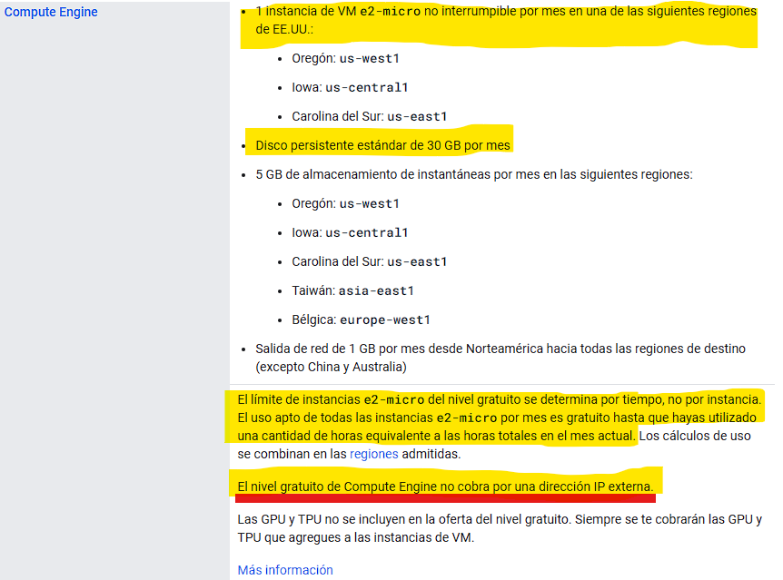
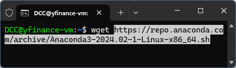

# GCP: Proyecto de Asesor Financiero

## Objetivo

Generar una propuesta de valor a través de la ingesta de datos históricos y en tiempo real de la valorización bursátil de las 10 empresas más importantes de NASDAQ-100.

Para ello se implementará una infraestructura en la nube utilizando:

1. máquina virtual para la ingesta de datos utilizando la biblioteca Yfinance en Python,
2. alimentar el data warehouse BigQuery,
3. utilizar SQL para hacer consultas a BigQuery,
4. visualización de data en Looker y conexión con PowerBI,
5. modelos de machine learning a partir de la información recabada, y
6. mantener la base de datos actualizada diariamente con Cloud Functions.

## Tabla de contenidos

* [Objetivo](https://github.com/datacloudclub/GCP-Asesor_financiero?tab=readme-ov-file#objetivo)
* [Introducción](https://github.com/datacloudclub/GCP-Asesor_financiero?tab=readme-ov-file#introducci%C3%B3n)
* [Descripción de las tecnologías utilizadas](https://github.com/datacloudclub/GCP-Asesor_financiero?tab=readme-ov-file#descripci%C3%B3n-de-las-tecnolog%C3%ADas-utilizadas)
* [Requisitos](https://github.com/datacloudclub/GCP-Asesor_financiero?tab=readme-ov-file#requisitos)

  * [Creación de cuenta de Gmail y activación de período de prueba](https://github.com/datacloudclub/GCP-Asesor_financiero?tab=readme-ov-file#creaci%C3%B3n-de-cuenta-de-gmail-y-activaci%C3%B3n-de-per%C3%ADodo-de-prueba)
  * [Compartir el proyecto con otras personas](https://github.com/datacloudclub/GCP-Asesor_financiero?tab=readme-ov-file#compartir-el-proyecto-con-otras-personas)
* [Aclaración sobre posibles gastos](https://github.com/datacloudclub/GCP-Asesor_financiero?tab=readme-ov-file#aclaraci%C3%B3n-sobre-posibles-gastos)
* [Paso 1: Preparación de la VM](https://github.com/datacloudclub/GCP-Asesor_financiero?tab=readme-ov-file#paso-1-preparaci%C3%B3n-de-la-vm)

  * [Creación de una instancia de máquina virtual](https://github.com/datacloudclub/GCP-Asesor_financiero?tab=readme-ov-file#creaci%C3%B3n-de-una-instancia-de-m%C3%A1quina-virtual)
  * [Instalación de Gcloud CLI](https://github.com/datacloudclub/GCP-Asesor_financiero/tree/main#instalaci%C3%B3n-gcloud-cli)
  * [Conexión remota mediante SSH](https://github.com/datacloudclub/GCP-Asesor_financiero/tree/main#conexi%C3%B3n-mediante-ssh)
  * [Instalación del entorno de Anaconda en la instancia](https://github.com/datacloudclub/GCP-Asesor_financiero/tree/main#instalaci%C3%B3n-del-entorno-de-anaconda-en-la-instancia)
  * [Usar un Jupyter Server para comenzar a trabajar con Python](https://github.com/datacloudclub/GCP-Asesor_financiero/tree/main#usar-un-jupyter-server-para-comenzar-a-trabajar-con-python)
* [Paso 2: Webscraping y uso de yfinance para obtener capitalización bursátil](https://github.com/datacloudclub/GCP-Asesor_financiero?tab=readme-ov-file#paso-2-webscraping-y-uso-de-yfinance-para-obtener-capitalizaci%C3%B3n-burs%C3%A1til)

  * Webscraping para obtener las companías de mayor capitalización
  * Cómo utilizar la biblioteca Yfinance
* Paso 3: Administración de BigQuery

  * Conectando desde Python a BigQuery para tranferir la información recabada a la base de datos
  * Uso de comandos SQL y de Bq para realizar queries a BigQuery
  * Conexión de BigQuery con Looker y PowerBI
* Paso 4: CI/CD con Cloud Functions

  * Utilizar Cloud Functions para actualizar la base de datos diariamente
* Paso 5: Herramientas de ML en la nube y en Python

  * Desplegar herramientas de Machine Learning en BigQuery con BigQueryML y VertexAI
  * Desplegar herramientas de Machine Learning en Python usando la información en BigQuery

## Introducción

El presente proyecto tiene como objetivo familiarizar con las herramientas elementales de Google Cloud Platform para el desarrollo de una arquitectura de carga y gestión de datos directamente en la nube.

Se parte desde una máquina virtual aprovechando los contenidos del Módulo 4 de Data Science sobre Big Data para reemplazar el VM VirtualBox que corría en nuestra CPU por una instancia de VM en la nube. Este servicio en GCP se llama Compute Engine y se encarga de administrar recursos para máquinas virtuales. Cada una de ellas se llama instancia.

Antes de comenzar, necesitamos contar con un proyecto asociado a una cuenta de facturación que nos permita utilizar los recursos de GCP.

Para conocer más acerca de los descuentos y servicios gratuitos que existen en GCP, y el período de prueba: [Documentación oficial acerca del Programa Gratuito de GCP](https://cloud.google.com/free/docs/free-cloud-features?hl=es-419).

Fuera del período de prueba, existe una capa gratuita de servicios que se pueden utilizar sin generar gastos (aunque de todas maneras se generan ciertos gastos por el uso de la red).

Crearemos la instancia de VM con las características de la capa gratuita: [Documentación sobre nivel gratuito de VM](https://cloud.google.com/free/docs/free-cloud-features?hl=es-419#compute)

### ¿Por qué usar una VM?

En todo proceso de ETL y EDA, se comienza por extraer una muestra de los datos para analizar su estructura y poder manipularlos. Esto se lleva a cabo en una máquina virtual que nos permite extraer, analizar y transformar detenidamente la estructura de los datos para volcarlos en una base de datos.

Generar un despliegue de principio a fin en la nube nos facilita la interacción entre la generación de los datos desde la máquina virtual y el alojamiento directo en el data warehouse BigQuery sin la necesidad de mayor infraestructura.

Para este proyecto, comenzaremos con el despliegue de una instancia de VM del tipo más económico para comprobar su eficacia; ya que, finalizado el período de prueba de 90 días, toda cuenta activa posee un nivel gratuito que incluye una VM micro y una dirección IP estática fija sin costo.

Al mismo tiempo, la VM sólo será utilizada para construir la primera parte del historial de valoración bursátil de las empresas. Una vez comprendida la lógica de funcionamiento del código y de la biblioteca yfinance, podremos reemplazar la VM por Cloud Functions que cumplan el rol de mantener la base de datos actualizada al tener que iterar para adquirir el valor de cierre del día que acaba de terminar.

Por otra parte, cuando querramos hacer modelos de Machine Learning necesitaremos tener comprensión de cómo funcionan las máquinas virtuales.

### ¿Por qué usar BigQuery?

Como ilustra la imagen a continuación, trabajaremos con tipos de datos estructurados y necesitamos una base de datos tabular (en forma de tablas) para su posterior análisis.

En este sentido, ofreceremos un producto de Machine Learning con Python en la VM y con herramientas de Machine Learning en la nube a través de BigQuery ML y Vertex AI.

Para mantener el data warehouse actualizado, desplegaremos Cloud Functions que irán ingestando una vez al día el valor de cierre de las acciones.

De las estrategias empleadas en el presente proyecto, esperamos que puedan aprender las siguientes habilidades:

* Integrar todos los conocimientos adquiridos en Henry: módulos 1 a 6.
* Crear una máquina virtual para generar un entorno de trabajo.
* Uso de librerías de Python.
* Habilidad para hacer webscraping.
* Ingesta de data en forma de dataframe en Python directamente al data warehouse.
* Conexión con herramientas de visualización.
* Propuesta de valor con Machine Learning en BigQuery con BigQueryML y en Python con las APIs y Frameworks de ML.

[volver a la Tabla de contenidos](https://github.com/datacloudclub/GCP-Asesor_financiero?tab=readme-ov-file#tabla-de-contenidos)

## Descripción de las tecnologías utilizadas

 - Máquina virtual para ejecutar aplicaciones.

 - Almacén de datos completamente gestionado por GCP para posterior análisis.

 - Aprendizaje automático en BigQuery para crear y ejecutar modelos de aprendizaje automático en SQL.

 - Consultas SQL estándar para interactuar con datos en BigQuery.

 - Funciones sin servidor para aplicaciones basadas en eventos.

 - Lenguaje de programación utilizado.

 - Manipulación y análisis de datos.

 - Crear visualizaciones estáticas, animadas e interactivas.

 - Aprendizaje automático.

 - Framework de aprendizaje profundo.

 - API de redes neuronales de alto nivel.

 - Procesamiento de lenguaje natural.

 - Estimación e interpretación de modelos estadísticos.

 - Biblioteca de imágenes para Python.

[volver a la Tabla de contenidos](https://github.com/datacloudclub/GCP-Asesor_financiero?tab=readme-ov-file#tabla-de-contenidos)

## Requisitos

* Disponer de una cuenta de facturación bajo período de prueba o activada.
  * O bien: Tarjeta bancaria (crédito o débito) para poder iniciar el período de prueba.
  * Si no se posee acceso a una tarjeta: Algún compañero que quiera compartir su proyecto con nosotros.

### Creación de cuenta de Gmail y activación de período de prueba

* Ver la siguiente guía: [Cómo acceder a la prueba gratituita con un crédito de US$300 para usar GCP
  ](https://github.com/datacloudclub/datacloudclub/blob/main/Google%20Cloud%20Platform%20(GCP)/Gu%C3%ADas/como_acceder.md#c%C3%B3mo-acceder-a-la-prueba-gratituita-con-un-cr%C3%A9dito-de-us300-para-usar-gcp)

[volver a la Tabla de contenidos](https://github.com/datacloudclub/GCP-Asesor_financiero?tab=readme-ov-file#tabla-de-contenidos)

### Compartir el proyecto con otras personas

* Ver la siguiente guía: [Cómo compartir mi proyecto con otras personas](https://github.com/datacloudclub/datacloudclub/blob/main/Google%20Cloud%20Platform%20(GCP)/Gu%C3%ADas/uso_compartido_proyecto.md)

[volver a la Tabla de contenidos](https://github.com/datacloudclub/GCP-Asesor_financiero?tab=readme-ov-file#tabla-de-contenidos)

## Aclaración sobre posibles gastos

* Cada cuenta de Gmail, cuenta con un período de prueba de 90 días y un saldo de US$300 para usar en GCP.
* Durante este período, no se genera ningún tipo de cargo.
* El uso por los servicios de GCP generan gastos que son absorbidos por el saldo de US$300.
* De esta manera podemos analizar el consumo eventual que genera operar utilizando GCP.
* Para acceder a este beneficio, es necesario disponer de una tarjeta de crédito o débito habilitada.
* No se genera ningún cargo en la tarjeta, pero durante el período de prueba no se puede eliminar la tarjeta de la cuenta, de lo contrario, no se puede seguir usando el período de prueba.
* La cuenta de GCP se paraliza automáticamente pasados los 90 días o si el saldo llega a US$ 0.
* Es decir, no hay problema si olvidamos servicios encendidos. Todos ellos serán inhabilitados llegado ese punto.
* Luego de terminada la prueba gratuita podemos acceder a la información relacionada con el proyecto y se conserva todo aquello que está incluido en la capa gratuita de GCP.
* Se pueden asignar todos los proyectos a una otra cuenta de facturación (por ejemplo, una cuenta que disponga saldo del período de prueba) para poder proseguir con el uso de los servicios.

[volver a la Tabla de contenidos](https://github.com/datacloudclub/GCP-Asesor_financiero?tab=readme-ov-file#tabla-de-contenidos)

## Paso 1: Preparación de la VM

El primer paso implica la creación de una instancia de VM, cómo conectarse de manera remota a ella y la instalación del entorno Anaconda para comenzar a trabajar en un Jupyter Lab con Python directamente desde el entorno cloud.

### Creación de una instancia de máquina virtual

* Para crear una instancia de VM: [Cómo crear una máquina virtual](https://github.com/datacloudclub/datacloudclub/blob/main/Google%20Cloud%20Platform%20(GCP)/Gu%C3%ADas/como_crear_vm.md)
* Para administrar una instancia ya creada de VM, cómo se detiene, edita, elimina o inicia: [Administrar una instancia de máquina virtual](https://github.com/datacloudclub/datacloudclub/blob/main/Google%20Cloud%20Platform%20(GCP)/Gu%C3%ADas/modificar_instancia.md)

Dentro de Compute Engine, en Instancias de VM, hacemos click sobre "Crear Instancia" para crear una nueva máquina virtual con las siguientes características:

* **Nombre:** yfinance-vm (sugerencia)
* **Región**: us-central1 (Iowa)
* **Zona**: us-central1-a
* **Tipo de máquina:** E2-micro
* **Sistema operativo:** Ubuntu
* **Versión:** 24.04 LTS (la versión más reciente, también se puede probar la 20, 22, 23)
* **Tipo de disco de arranque:** disco persistente equilibrado
* **Tamaño (GB):** 30
* **IP externa fija**

Debemos tomar nota de la dirección IP externa que nos servirá para conectarnos a la VM, en nuestro caso es: 35.208.82.103

[volver a la Tabla de contenidos](https://github.com/datacloudclub/GCP-Asesor_financiero?tab=readme-ov-file#tabla-de-contenidos)

### Instalación Gcloud CLI en local

Es necesario instalar en nuestra PC para poder conectarnos con los servicios en GCP:

* Gcloud CLI, la interfaz línea de comandos (CLI en inglés) de Gcloud para acceder a la cuenta de GCP desde la Terminal.
* Documentación oficial para instalar Gcloud CLI: [Instala Google Cloud CLI](https://cloud.google.com/sdk/docs/install-sdk?hl=es-419)

* Si necesitás una guía paso a paso de cómo hacer esto: [Descarga e instalación de Gcloud CLI para conectarme de manera remota a los servicios en la nube](https://github.com/datacloudclub/datacloudclub/blob/main/Google%20Cloud%20Platform%20(GCP)/Gu%C3%ADas/gcloud_cli_install.md).

Y las siguientes extensiones para Visual Studio Code:

* [Remote - SSH para VSC](https://marketplace.visualstudio.com/items?itemName=ms-vscode-remote.remote-ssh)
* [Remote - SSH: editor de archivos de configuración para VSC](https://marketplace.visualstudio.com/items?itemName=ms-vscode-remote.remote-ssh-edit)
* [Remote Explorer para VSC](https://marketplace.visualstudio.com/items?itemName=ms-vscode.remote-explorer)

[volver a la Tabla de contenidos](https://github.com/datacloudclub/GCP-Asesor_financiero?tab=readme-ov-file#tabla-de-contenidos)

### Conexión mediante SSH

Necesitamos generar las credenciales que nos permitan conectarnos a la instancia mediante canal SSH (Secure Shell), un protocolo de red que permite el acceso remoto a través de una conexión cifrada.

* Para saber más sobre cómo conectarse vía SSH: [Cómo conectarse a la instancia vía SSH](https://github.com/datacloudclub/datacloudclub/blob/main/Google%20Cloud%20Platform%20(GCP)/Gu%C3%ADas/conexion_ssh.md)

[volver a la Tabla de contenidos](https://github.com/datacloudclub/GCP-Asesor_financiero?tab=readme-ov-file#tabla-de-contenidos)

### Instalación del entorno de Anaconda en la instancia

Para descargar Anaconda, [visitamos la página oficial](https://www.anaconda.com/) en nuestro explorador en local. Vamos a donde dice "Free Download"

En el recuadro donde nos pide correo electrónico, debajo dice "skip registration" para evitar registrarnos.

Allí veremos las descargas para las distintas plataformas. En Linux, buscamos el link correspondiente a la descarga de 64-bit (x86), apretamos click derecho sobre él y elegimos "Copiar dirección del vínculo".

Conectados via SSH con la VM mediante el comando `ssh yfinance` para permitir el uso del puerto 8888 para Jupyter server y escribimos: `wget` para descargar el archivo, y pegamos la URL que habíamos copiado en la página de descargas: `wget https://repo.anaconda.com/archive/Anaconda3-2024.02-1-Linux-x86_64.sh`.

Luego de que se haya descargado, convertimos el archivo descargado en ejecutable utlizando el comando `chmod +x Anaconda3-2024.02-1-Linux-x86_64.sh` y lo ejecutamos `./Anaconda3-2024.02-1-Linux-x86_64.sh`

Presionamos `ENTER `y deberemos leer el Acuerdo de Licencia hasta llegar al final para escribir "yes" aceptándo los términos y condiciones para comenzar la descarga:

Luego nos ofrece un directorio de instalación, presionamos `ENTER `para dejar el directorio por defecto `/home/{usuario}/anaconda3`

Antes de finalizar, nos pregunta si cada vez que iniciamos la VM queremos hacerlo en un entorno de Anaconda, ponemos "yes":

Una vez finalizada la instalación, nos pide salir de la conexión con la VM, escribimos el comando `exit`

Y luego nos conectamos nuevamente a la VM con `ssh yfinance` y nótese cómo ahora dice (base) delante del símbolo $. Quiere decir que Anaconda fue correctamente instalado y está funcionando.

[volver a la Tabla de contenidos](https://github.com/datacloudclub/GCP-Asesor_financiero?tab=readme-ov-file#tabla-de-contenidos)

### Usar un Jupyter Server para comenzar a trabajar con Python

Al inciar un Jupyter Server, el mismo utiliza el puerto 8888 en la VM. Para que podamos utilizar el puerto y conectarnos desde nuestra computadora local utilizando nuestro navegador al Jupyter server, debemos hacer *port forwarding*: vincular el puerto de la VM con el puerto en nuestra PC.

Para ello, desde la Terminal en nuestra PC, nos conectamos con la instancia con el comando `ssh` con la siguiente modificación: `ssh -L 8888:localhost:8888 yfinance`, de manera que el puerto 8888 de la instancia se vea reflejado a través de localhost:8888 en local.

Ya dentro de la VM, debemos iniciar Jupyter, con el comando `jupyter lab`

La terminal quedará tomada y la deberemos dejar así para que funcione el Jupyter Server. Si quisieramos utilizar la VM para otra cosa, deberemos crear otra terminal nueva. Si cerramos la terminal, o interrumpimos el funcionamiento con `CTRL` + `C`, se cierra el Jupyter Server.

Notemos que aparece un token que será pedido cuando ingresemos al Jupyter: en este caso es feb8264feb4e248a26b89ce16a8348c7607717d418711bce

En una ventana en nuestro explorador, navegamos a la página: `localhost:8888` o manteniendo apretado la tecla `CTRL` hacemos click sobre el link en la Terminal.

En "Password or token" debemos pegar de la terminal del Jupyter el token mencionado anteriormente:

Y ya tenemos entorno de Jupyter para trabajar con Python en nuestra VM:

**Recordatorio:** Si se cierra la ventana de la terminal que se utilizó para iniciar el Jupyter, la información no guardada se pierde.

[volver a la Tabla de contenidos](https://github.com/datacloudclub/GCP-Asesor_financiero?tab=readme-ov-file#tabla-de-contenidos)

## Paso 2: Webscraping y uso de yfinance para obtener capitalización bursátil

El segundo paso empieza con la obtención de las primeras 100 empresas mediante webscraping.
